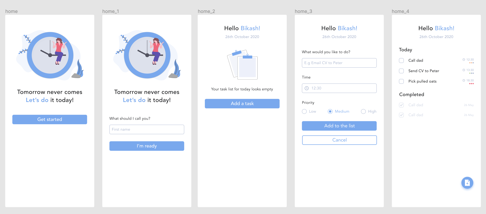
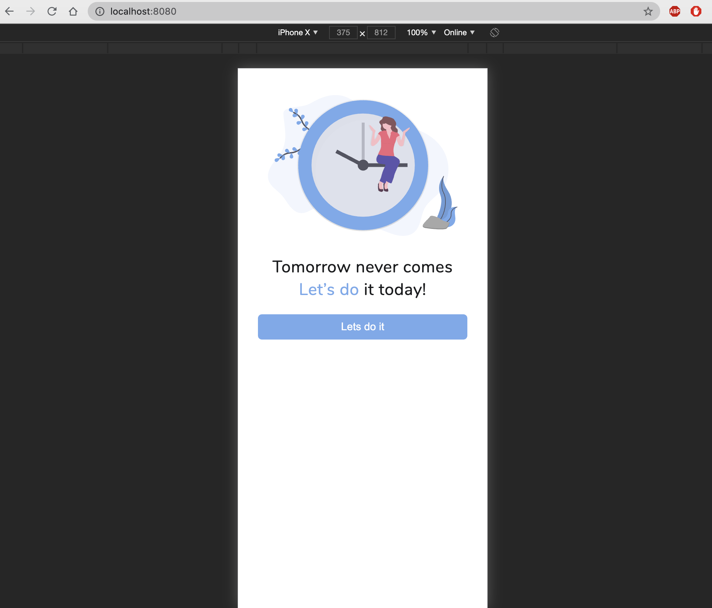
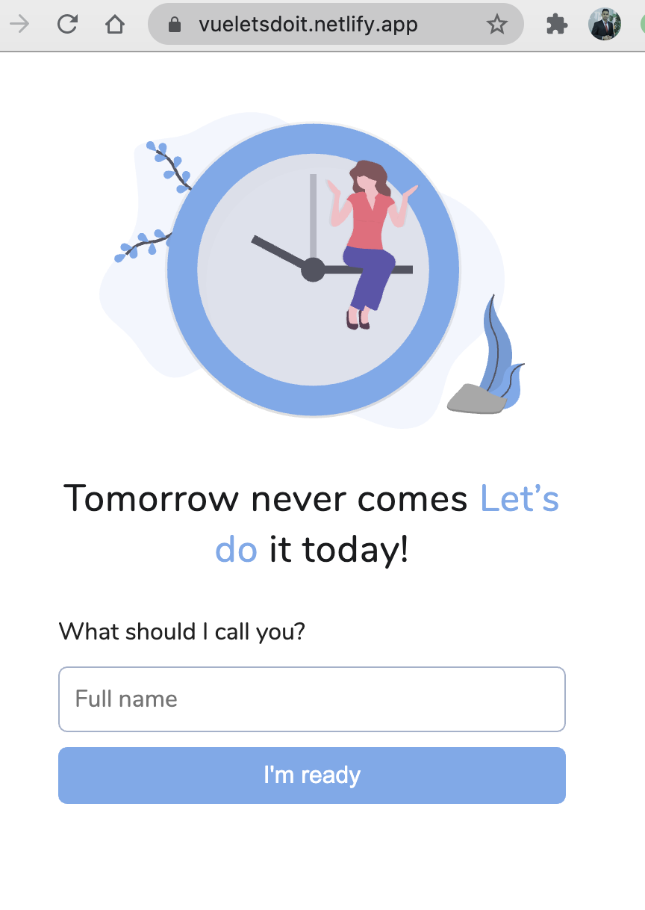
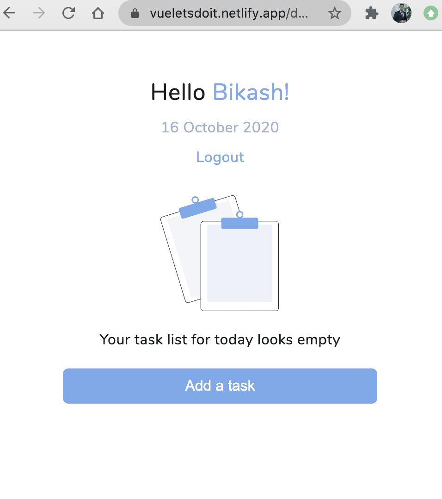
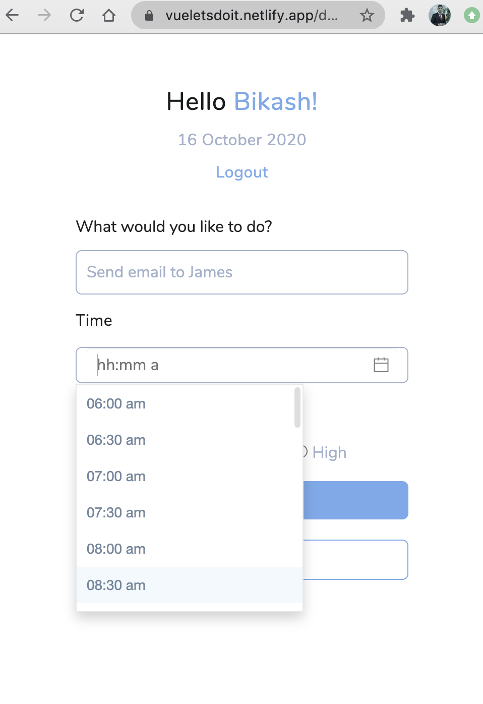
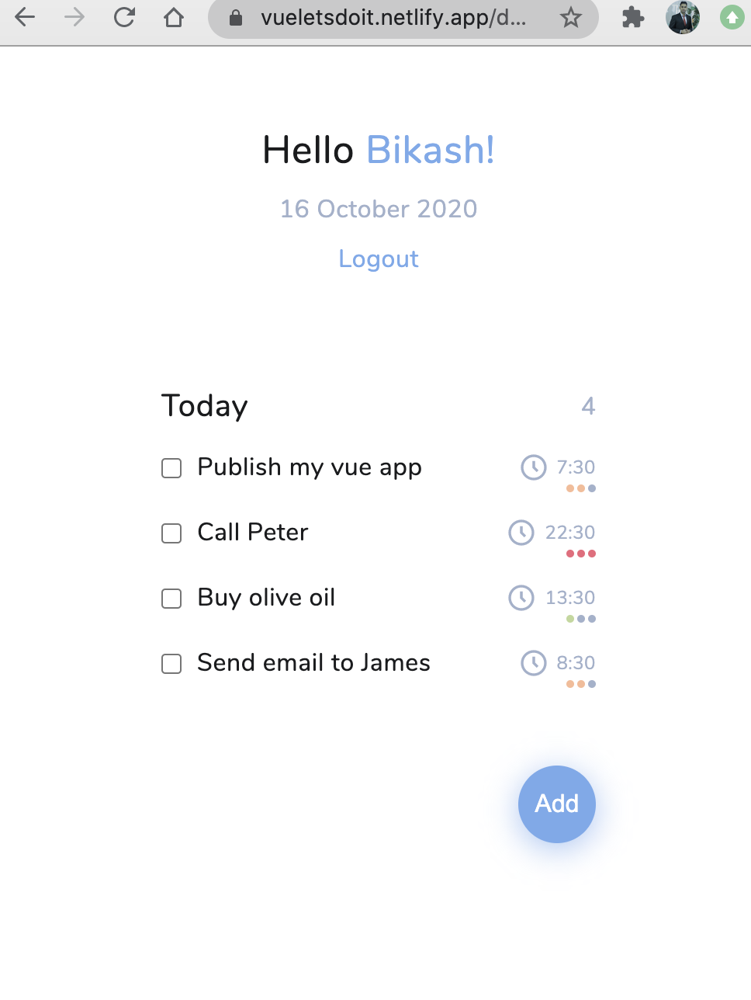
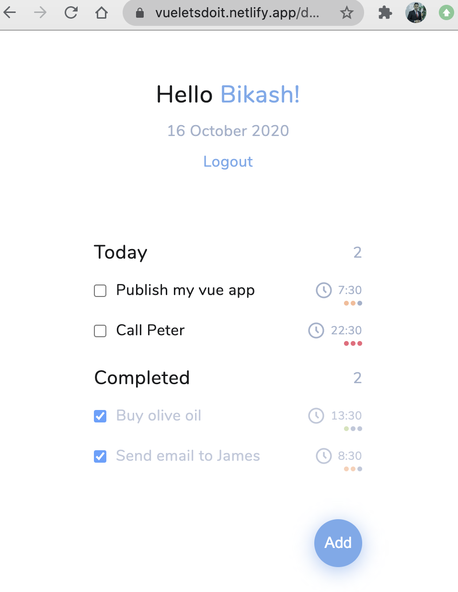
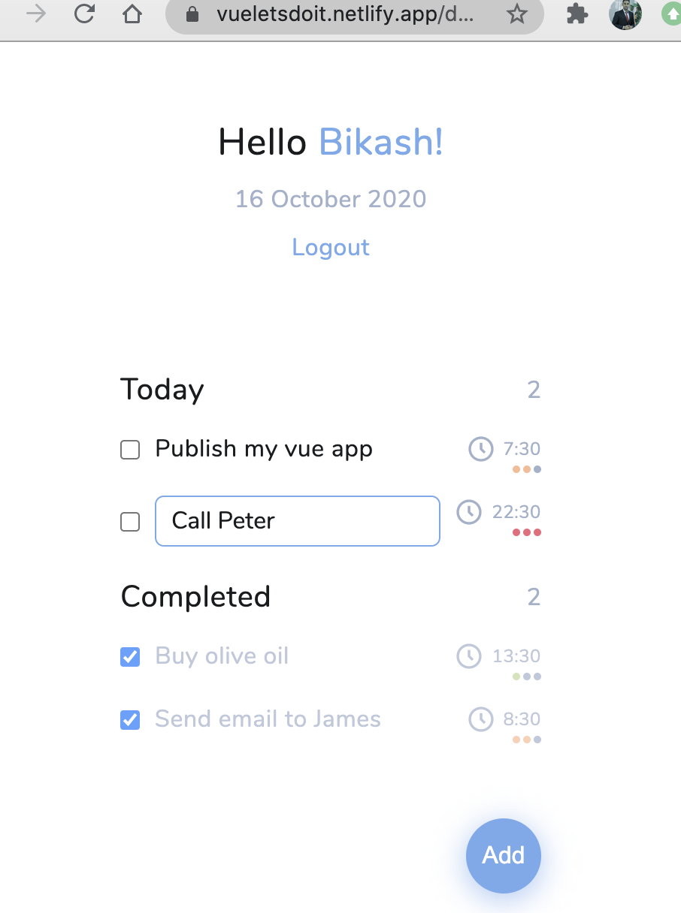

# Let's do it! 
- Live link -> https://vueletsdoit.netlify.app/
- Tomorrow never comes. Let's do it today! This is a web based task management app done with Vue.js.

## Design
- In order to start the project I did a quick prototype design in Figma with the mobile first approach.

## Features
- Get in by entering a Firstname
- Add task, set the time and priority
- Mark task as completed
- Edit the task by double clicking 
- Data saved in the local storage

## Tech stack 
- Vue.js
- Vuex
- CSS
- JavaScript

## Future plan
- Implement back end with Google firebase

## Screenshots

