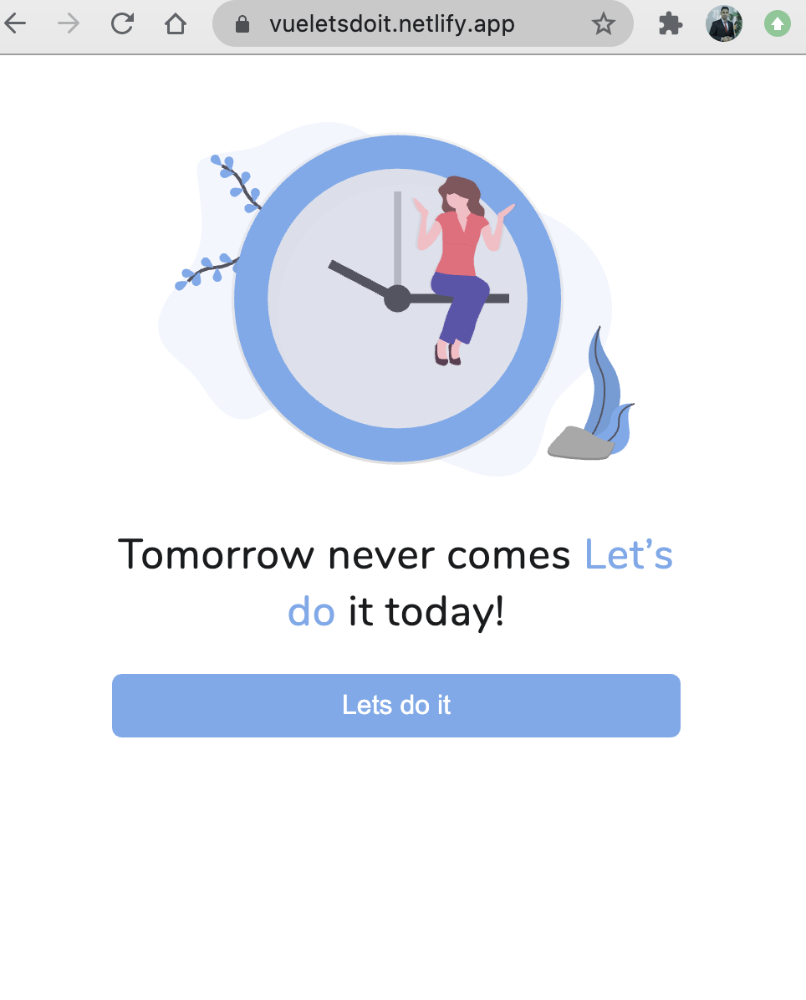

# Let's do it! 

- Tomorrow never comes. Let's do it today! This is a web based task management app done with Vue.js.
 - `More info in compiling ..`

## Design
- In order to start the project I did a quick prototype design in Figma with the mobile first approach.

## Development 

